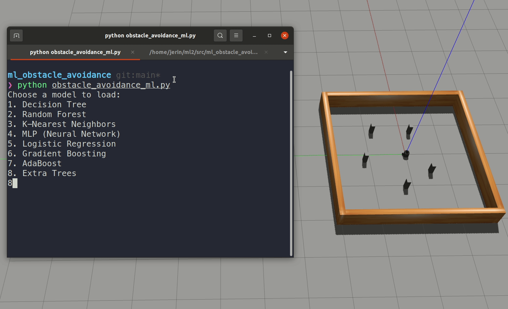

# Machine Learning & Data Analysis

## Project - Autonomous Driving and Obstacle avoidance using Machine Learning algorithm in ROS.

## Team Members:
- Jerin Joy (5061530)
- Koushikmani Maskalmatti Lakshman (5053566)

## Description of the Project:
The Turtlebot robot is a popular platform for robotics research and education. With its sensors, cameras, and actuators, it provides a great platform for testing and developing algorithms for robot navigation and control. One of the key challenges in robotics is autonomous driving and obstacle avoidance, which involves navigating in an environment with unknown obstacles and avoiding collisions. This project aims to address this challenge by using machine learning algorithms to train the Turtlebot robot to avoid obstacles.

To implement obstacle avoidance, we start by collecting data using the Turtlebot's laser range finder. This sensor measures the distance to obstacles in the environment and provides a 2D scan of the surroundings. We use this data to train various machine learning classifiers such as Random Forest, KNN, MLP, AdaBoost, Logistic Regression, Gradient Boosting, Extra Tree and Decision Trees. These classifiers learn to classify the environment into obstacle and non-obstacle regions based on the laser scan data. Once the classifiers are trained, we use them to implement obstacle avoidance in the Turtlebot robot. This allows the robot to navigate autonomously in an unknown environment, avoiding obstacles in its path. By using machine learning, we can create intelligent robots that can adapt to different environments and tasks, making them more useful and versatile.

## Jupyter Notebook:
The Jupyter Notebook used for the Machine Learning data training and model evaluation can be found [here](ml_training_evaluation.ipynb)

## Installation Setup:
- OS Version: [Ubuntu 20.04](https://releases.ubuntu.com/focal/)
- This package is developed with ROS Noetic. To install ROS Noetic, follow the [official documentation](http://wiki.ros.org/noetic/Installation/Ubuntu).
- Jupyter Notebook


## Classifiers used:
- Decision Tree
- Random Forest
- K-Nearest Neighbors
- MLP Classifier
- Logistic Regression
- Gradient Boosting
- AdaBoost 
- Extra Tree

## Code Execution Process:
1. Clone the package into the src folder of the ROS Workspace:
```
git clone https://github.com/jerin-joy/ml_obstacle_avoidance
```

2. Compile the workspace by navigating to the workspace and entering in terminal:
```
catkin_make
```
3. Source the workspace by entering:
```
source devel/setup.bash
```
4. Launch the Gazebo simulator with the Turtlebot robot and simulation environment by entering:
```
roslaunch turtlebot3_neural_network turtlebot3_square.launch
```
5. To test the trained model in the Gazebo environment, enter:
```
python obstacle_avoidance_ml.py
```
6. Select the classifier you need to use from the list provided in the terminal. 


## Retraining the model (Optional):

If you need to retrain the model with new data, follow these steps:

1. To perform the obstacle avoidance of the robot using Laser Range Finder, enter:
```
python obstacle_avoidance_laser.py
```
2. Open a new terminal to record the data from LRF and enter:
```
python data_recorder.py
```
3. Open the 'ml_training_evaluation.ipynb' Jupyter Notebook file and run all blocks for the data training and model evaluation.
   
4. To test the Machine Learning model on the TurtleBot robot, launch the gazebo world again and enter:
```
python obstacle_avoidance_ml.py
```
5. Select the classifier you need to use from the list provided in the terminal. 

## Simulation Demo using the Trained Model:


   
## Conclusion:
Based on the evaluation results of the seven models, the GradientBoostingClassifier seems to be the best model with an accuracy of 0.8750, precision of 0.9137, recall of 0.8930, F1 score of 0.9032, and ROC AUC score of 0.9390.

The RandomForestClassifier also performed well with an accuracy of 0.8609, precision of 0.9219, recall of 0.8598, F1 score of 0.8898, and ROC AUC score of 0.9366.

It's worth noting that the LogisticRegression model performed the worst among the seven models with an accuracy of 0.6634, precision of 0.6979, recall of 0.8543, F1 score of 0.7682, and ROC AUC score of 0.7083.